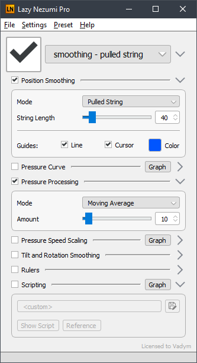

# Light theme for Lazy Nezumi

It's not perfect, but it gets the job done, you know?

The on/off button is a checkbox because I could not accurately re-create the Cool Button in
light colors.

## Installing

1.	Download this repository.\
	That's `❮❯ Code` ➜ `Download ZIP`, or "clone" it if you know Git
2.	Copy the `WindowsLight` folder to `%LOCALAPPDATA%\Lazy Nezumi Pro\themes`\
	You can paste that path into Explorer's "address bar" to open the folder.
3.	Restart Lazy Nezumi if it was open.

"WindowsLight" should now be selectable under menu:`Settings` ➜ `Themes`.