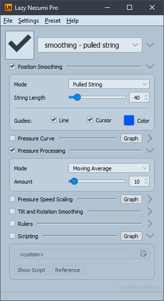
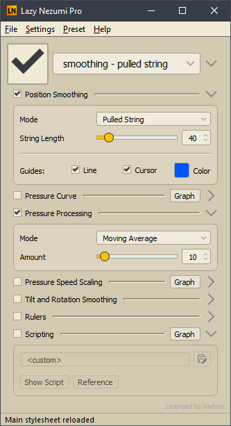

# Semi-light theme for Lazy Nezumi

This one is slightly darker and has a color tint to it.

Edit the `@hue@` in `mainStyle.qss` to your liking.

If you want multiple of these, rename the directory
and either edit the `@themeImages@` in `mainStyle.qss`
or keep the regular theme installed alongside.

Haven't found what the selector for the "licensed to" label is supposed to be,
should you be wondering.

## Installing

1.	Download this repository.\
	That's `❮❯ Code` ➜ `Download ZIP`, or "clone" it if you know Git
2.	Copy the `WindowsLight` folder to `%LOCALAPPDATA%\Lazy Nezumi Pro\themes`\
	You can paste that path into Explorer's "address bar" to open the folder.
3.	Restart Lazy Nezumi if it was open.

"WindowsLight" should now be selectable under menu:`Settings` ➜ `Themes`.